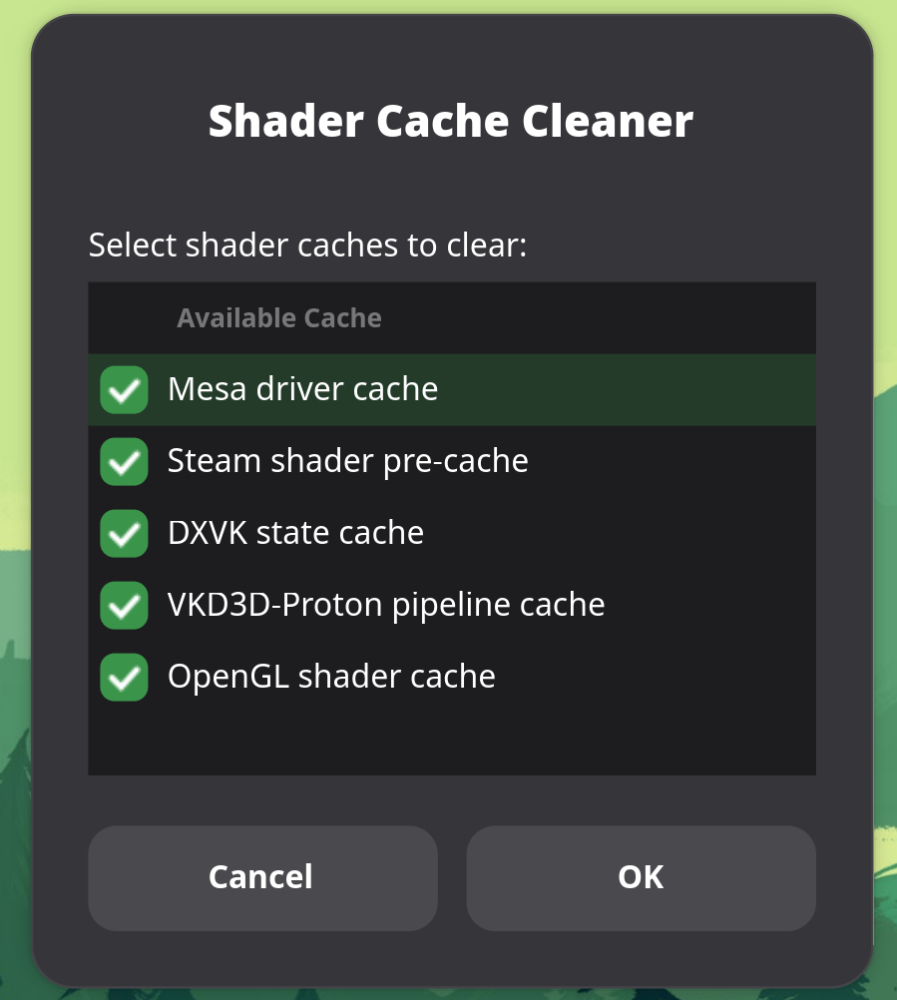

A simple Linux gaming shader cache cleaner with a GUI.
No terminal required after install — just click it in your app menu, pick what to nuke, confirm, done.



## What it clears

- **Mesa driver cache** — RADV/ANV compiled shaders (`~/.cache/mesa_shader_cache/`)
- **Steam shader pre-cache** — Vulkan shaders downloaded by Steam (will re-download)
- **DXVK state cache** — D3D11→Vulkan pipeline cache (rebuilds on next launch with minor stutter)
- **VKD3D-Proton pipeline cache** — D3D12→Vulkan pipeline cache (same stutter caveat)
- **OpenGL shader cache** — Legacy GL cache, rarely needed for modern titles

UnShade reads your Steam `libraryfolders.vdf` to find all your Steam libraries automatically — no hardcoded paths, works on any machine.

## Requirements

- `zenity` — for the checkbox dialog
- `kdialog` — for confirmation and error dialogs (KDE)
- `steam` — obviously

Both `zenity` and `kdialog` are pre-installed on Bazzite, Nobara, and most KDE-based distros.

## Install

```bash
curl -fsSL https://raw.githubusercontent.com/andy10115/UnShade/main/install.sh | bash
```

That's it. UnShade will appear in your app menu under Games/Utilities.

> **Steam Deck users:** UnShade isn't a Decky plugin yet, but you can use the [Quick Launch](https://github.com/nichobi/deckly-quick-launch) Decky plugin to call it directly. Make sure you "Show Hidden Files" and point it at `~/.local/bin/unshade.sh`. This will create a Non-Steam Game to invoke the script inside of Game Mode.

## Updates

UnShade checks for updates automatically each time it launches. If a new version is available you'll be prompted to update — it takes one click and requires a relaunch. No action needed on your end otherwise. If you're offline the check is skipped silently and everything works as normal.

## Known Limitations

- **Flatpak Steam is not currently supported.** UnShade reads from the default Steam config path (`~/.steam/steam/config/libraryfolders.vdf`). If you're running Flatpak Steam your library paths will differ and caches may not be found. Support is planned for a future release.

## Uninstall

```bash
rm ~/.local/bin/unshade.sh
rm ~/.local/share/applications/unshade.desktop
rm ~/.local/share/icons/unshade.svg
```

## Why

Clearing shader caches is a common debugging step on Linux — especially when chasing driver regressions, Proton updates, or Mesa upgrades. There was no dedicated GUI tool for it, so here we are.

## Tested on

- Bazzite (KDE)
- Nobara
- CachyOS
- Fedora 44 (KDE)

## License

MIT
